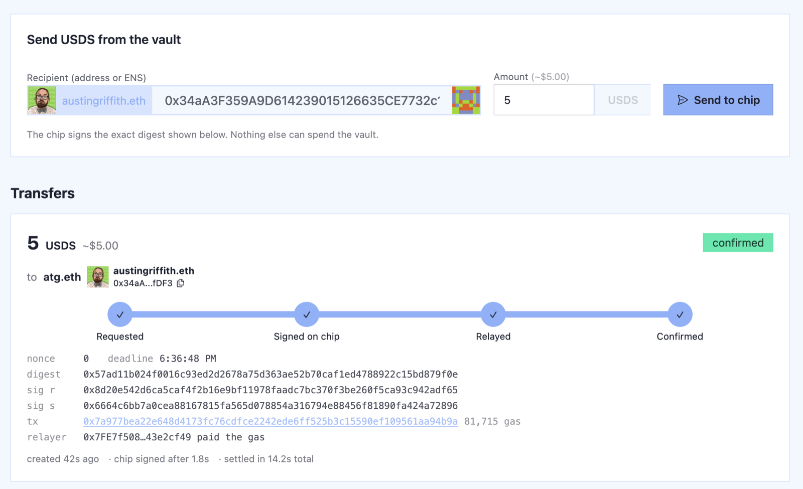
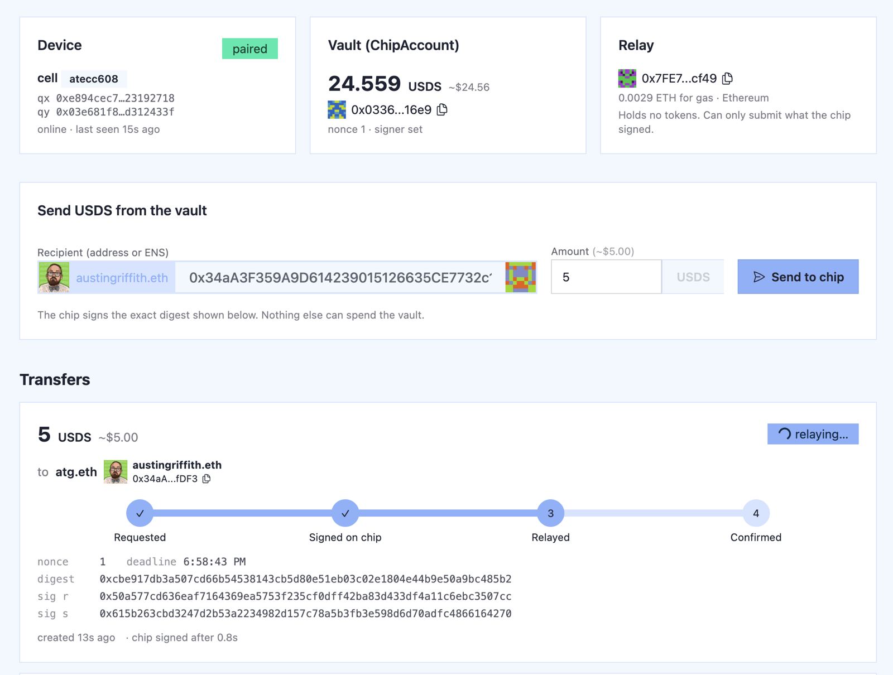
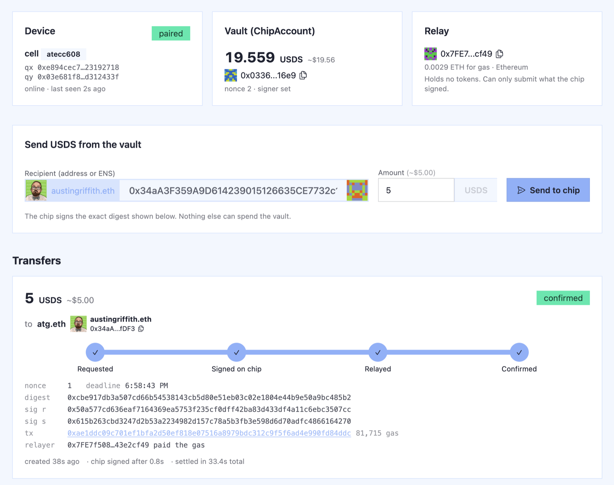
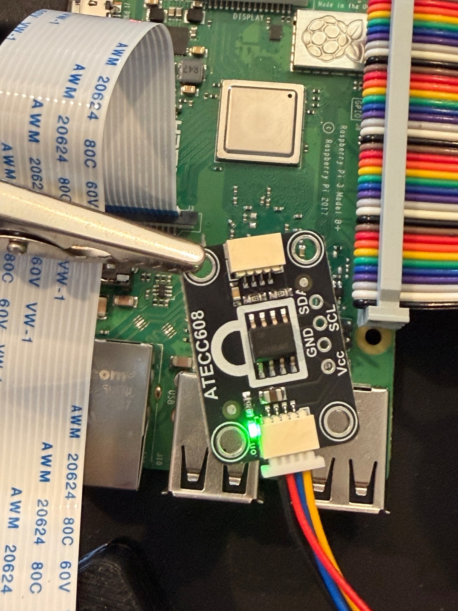

# ATECC608 demo — hardware-signed stablecoin transfers

A Raspberry Pi with an ATECC608 secure element signs a USDS transfer. A relay pays the gas.
A smart contract verifies the chip's P-256 signature and moves the funds. Nobody ever sees the key.

```
browser  -> app: "send 5 USDS to atg.eth"
app      -> builds EIP-712 digest {token, to, amount, nonce, deadline}
Pi       <- polls the app, signs the digest inside the ATECC608, posts (r, s)
relay    -> ChipAccount.executeTransfer(...)   (relay pays gas, holds nothing)
contract -> P256.verify(digest, r, s, chipPubKey) -> USDS.transfer(to, amount)
```

## It ran on mainnet



2026-09-04. Vault [`0x0336aD6afc8bE414D6BD1f7A16caEb14BCCd16e9`](https://etherscan.io/address/0x0336aD6afc8bE414D6BD1f7A16caEb14BCCd16e9)
(verified source), real [USDS](https://etherscan.io/token/0xdC035D45d973E3EC169d2276DDab16f1e407384F).

| Step | Tx | Notes |
|------|----|-------|
| Deploy `ChipAccount` with the chip's key baked in | [`0xa5d10ea4…`](https://etherscan.io/tx/0xa5d10ea42dfff94a6437ace48cc1440b21749dbe37e171863e8a79347369c805) | `yarn deploy --network mainnet`, 0.000056 ETH |
| 10 USDS into the vault | [`0xb85ad3ff…`](https://etherscan.io/tx/0xb85ad3fff1585504f6866d538abb0653b7e7293c4de7a9e2871d9b5a1a94bf88) | plain ERC-20 transfer from a wallet |
| **5 USDS to atg.eth, signed by the ATECC608** | [`0x7a977bea…`](https://etherscan.io/tx/0x7a977bea22e648d4173fc76cdfce2242ede6ff525b3c15590ef109561aa94b9a) | chip signed in 106 ms, 1.8 s after the click; 81,715 gas paid by the relay; confirmed 14 s after the click |
| **5 more USDS to atg.eth** (nonce 1) | [`0xae1ddc09…`](https://etherscan.io/tx/0xae1ddc09c701ef1bfa2d50ef818e07516a8979bdc312c9f5f6ad4e990fd84ddc) | chip signed 0.8 s after the click; 81,715 gas; confirmed in 33 s (waited a block) |

The second send, mid-flight and done. Same key, next nonce, no setup:

| relaying | confirmed |
|---|---|
|  |  |

Chip: ATECC608A on an Adafruit STEMMA QT breakout, Raspberry Pi 3 B+, serial `01235e6763cc8d97ee`,
key in slot 0. The private key has never existed outside that chip. The relay
(`0x7FE7f508A267BF45D2D161F244DbB12743e2cf49`) is a throwaway foundry keystore account that holds
0.003 ETH for gas and can't spend the vault.

Two folders:

- **`app/`** — Scaffold-ETH 2 (Foundry flavour, from ethskills.com). Contracts, tests, Next.js UI, and
  the queue + relay as Next.js route handlers.
- **`pi/`** — the signer that runs on the Pi. Has a `--mock` mode so the whole loop runs with no hardware.

## Run it (three terminals + the Pi)

```bash
cd app && yarn install
yarn chain                      # 1. anvil
yarn deploy                     # 2. ChipAccount + MockUSDS (1,000 USDS minted into the vault)
yarn start                      # 3. http://localhost:3000
```

Then the signer, from a Pi (or this machine in mock mode):

```bash
cd pi && pip3 install -r requirements.txt
python3 signer.py run --mock --app http://localhost:3000          # no chip yet
python3 signer.py run --app http://<mac-ip>:3000 --i2c-addr 0x60  # real chip, see pi/README.md
```

Open **/setup** and walk the four steps: lock the chip's config zone (once, real chip only), generate a
key, pair it with the vault, fund the vault. The browser queues each job, the Pi runs it and reports
back. Then on **Send** type `atg.eth` and `5`, press **Send to chip**, and watch
Requested → Signed on chip → Relayed → Confirmed.

## You have a fresh chip? Read this first



A new ATECC608 breakout is blank and unlocked, and **an unlocked ATECC608 refuses to make a key or
sign** (every crypto command returns `0xF4`). You must lock its **config zone** once. That is
permanent, and it is normal: every chip in use is config-locked. It does not put a key in and does
not stop you making new keys later. The **data zone stays unlocked**, so "Generate a new key" works
forever.

The full walkthrough with real outputs from the chip we did this to is in
**[`pi/README.md`](pi/README.md)**. Short version:

1. Wire SDA/SCL/3V3/GND, find it at I2C `0x60`.
2. `pip3 install --user --break-system-packages cryptoauthlib requests cryptography`
3. `./start.sh http://<laptop-ip>:3000 --i2c-addr 0x60 --allow-lock`
4. In the app, /setup: **Lock config zone** → **Generate key** → **Pair key** → **Mint into vault**.
5. /send: 5 USDS to `atg.eth`. The chip signs in ~100 ms; the relay settles it.

Verified 2026-09-04 on an ATECC608A (Adafruit STEMMA QT breakout, Raspberry Pi 3 B+): locked
config, generated a key, paired, signed, settled onchain, data zone never locked.

## Why P-256

The ATECC608 only does NIST P-256 (secp256r1). Ethereum's `ecrecover` is secp256k1, so the chip can't
be a normal EOA. Instead `ChipAccount` is a small vault contract whose owner is a P-256 public key.
Verification uses OpenZeppelin's `P256` library: the RIP-7212 / EIP-7951 precompile where the chain has
it (mainnet since Fusaka, Base, Optimism, Arbitrum, Polygon), pure Solidity otherwise. Local anvil works
either way; the tests run at ~110k gas per transfer.

## What's where

| Path | What |
|------|------|
| `app/packages/foundry/contracts/ChipAccount.sol` | vault owned by a P-256 key; `executeTransfer` verifies + transfers; nonce + deadline replay protection |
| `app/packages/foundry/contracts/MockUSDS.sol` | 18-decimal play USDS for localhost |
| `app/packages/foundry/script/DeployChipDemo.s.sol` | deploy; env `CHIP_PUBKEY_X/Y`, `CHIP_ADMIN`, `USDS_ADDRESS` |
| `app/packages/foundry/test/ChipAccount.t.sol` | 12 tests; signatures come from `pi/signer.py --mock` over ffi |
| `app/packages/nextjs/app/page.tsx` | Send: device / vault / relay status, send form, transfer timeline |
| `app/packages/nextjs/app/setup/page.tsx` | Setup: lock config, generate key, pair, fund |
| `app/packages/nextjs/app/api/*` | `device` (announce), `commands` (jobs for the Pi), `pair` (setSigner), `fund` (local mint), `requests` (queue + digest), `requests/[id]/signature` (verify + relay), `state` |
| `app/packages/nextjs/services/chip/*` | JSON-file store, chain clients, relay |
| `pi/signer.py` | announce, run setup jobs (status / genkey / lock-config), poll, sign, post. `--mock`, `--confirm`, `--button`, `--allow-lock` |
| `pi/start.sh` | background the signer on the Pi (pid file + log) |
| `pi/provision.py` | CLI fallback for the setup steps (config lock + GenKey; data zone left unlocked) |
| `pi/README.md` | **the fresh-chip guide**: what locking means, every step with real outputs, every error |

## Audit

Job #814 from [onedollaraudit.com](http://onedollaraudit.com/audit/814) (AI review, 2026-09-05), run against
the verified mainnet contract: [report](https://leftclaw.services/result/814.html) ·
[IPFS copy](https://bafkreietio65vfelp3t5pkhxzts66gieq3ott7wt4dqrznbnrvixitiatu.ipfs.community.bgipfs.com/).

Result: 1 High, 3 Medium, 6 Low, 4 Info. **No path found for an outside attacker to take funds.** Every
finding is about funds getting stuck or about trusting the admin key. Our read, and what we did:

| # | Sev | Finding | Status |
|---|-----|---------|--------|
| 1 | High | If the token pauses or blocklists the vault, funds are stuck (no admin rescue path). | Accepted for the demo. A rescue path is an admin backdoor, which is the opposite of the point. |
| 2 | Med | Admin can `setSigner` to any key and drain. | True by design: admin = deployer = relay keystore on one laptop. For real money, admin should be a multisig or burned (`setAdmin` to a dead address). |
| 3 | Med | `setSigner` doesn't check the key is on the curve; a bad key bricks transfers until re-paired. | Accepted; re-pairing fixes it. |
| 4 | Med | Signatures made for a future nonce could replay after re-pairing back to the same chip. | Accepted; the app never pre-signs future nonces. |
| 5-10 | Low | `isValidTransfer` preview omits checks; ETH sent to the contract is stuck; fixed deadline; event logs requested not received amount; no reentrancy guard; single-step `setAdmin`. | Accepted for the demo. |
| 11-14 | Info | evm version note, precompile trust, missing constructor event, no pause. | No action. |

The report's own caveat applies: an AI review "can never verify the complete absence of vulnerabilities."

**Overnight test (2026-09-04):** ~125 USDS left in the vault on mainnet with the Pi signer *stopped*.
With the signer up, anyone who can reach the app on the LAN could queue a transfer and the chip would
sign it; the demo app has no auth on `/api/requests`. That is the actual attack surface of this setup,
not the contract.

## Trust model

- The chip key is the only thing that can spend the vault. The relay just pays gas and can only refuse.
- Each signature covers token, recipient, amount, nonce, deadline, chain id and contract address.
  Replays and tampering fail (`test_replayIsRejected`, `test_tamperedAmountIsRejected`, …).
- `admin` (the deployer) can re-pair a new chip key. That is a demo convenience; for real money hand it
  to a multisig or burn it.
- The app has no auth. Whoever can reach it can ask the chip to sign. Run the signer with `--confirm`
  or `--button` to require a physical yes, or keep the app off the network.

## Live chain (what we did for mainnet)

One account is deployer, contract admin, and relay. It lives as an encrypted foundry keystore; no raw
key in any file.

```bash
# 1. account. Password goes in a file only; the key never prints.
PW=$(openssl rand -hex 24); umask 077; printf '%s' "$PW" > ~/.foundry/keystores/atecc-relay.password.txt
cast wallet new ~/.foundry/keystores --unsafe-password "$PW"     # prints the address; rename the file to atecc-relay
# send it ~0.003 ETH

# 2. app/packages/foundry/.env
USDS_ADDRESS=0xdC035D45d973E3EC169d2276DDab16f1e407384F
CHIP_PUBKEY_X=0x…   CHIP_PUBKEY_Y=0x…      # from the Setup page or `python3 pi/signer.py pubkey`

# 3. deploy + verify with Scaffold-ETH. ETH_PASSWORD is the password *file* path.
cd app
ETH_PASSWORD=$HOME/.foundry/keystores/atecc-relay.password.txt yarn deploy --network mainnet --keystore atecc-relay
yarn verify --network mainnet

# 4. app/packages/nextjs/.env.local
NEXT_PUBLIC_TARGET_NETWORK=mainnet
RELAYER_KEYSTORE=atecc-relay
RELAYER_KEYSTORE_PASSWORD_FILE=/Users/you/.foundry/keystores/atecc-relay.password.txt
USDS_ADDRESS=0xdC035D45d973E3EC169d2276DDab16f1e407384F

yarn dev -p 3000
```

Send USDS to the vault address the deploy printed. The Pi needs no change: the EIP-712 domain picks up
chain id 1 from the app. Type a recipient and amount, Send to chip, done.

Because the deploy baked in `CHIP_PUBKEY_X/Y`, no Pair step was needed. Generate a new key later and
the Pair button still works: the relay is the admin.

Gotcha: in foundry 1.7 the env var `ETH_PASSWORD` is the path to a password *file*, not the password.
Passing the password itself makes foundry print it in an error. Rotate with `cast wallet change-password`
if that happens (we did).

Everything secret is gitignored: `.env`, `.env.local`, the keystore and its password file live in
`~/.foundry/keystores`.
